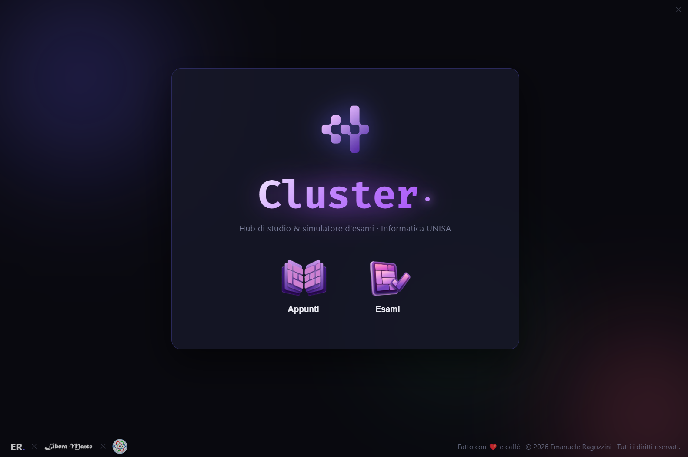
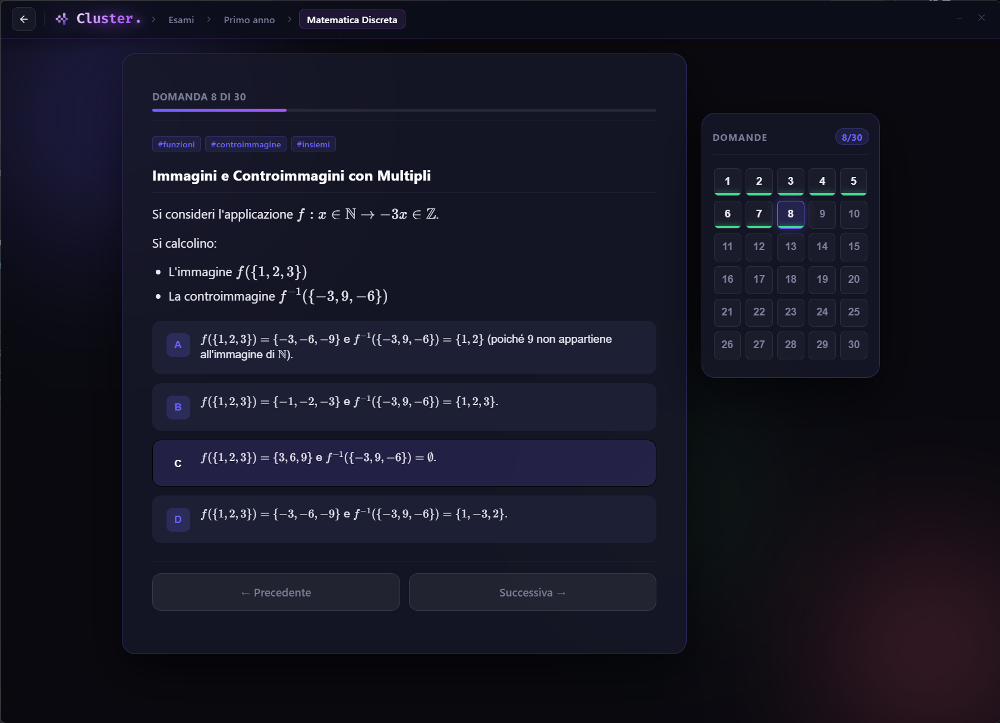
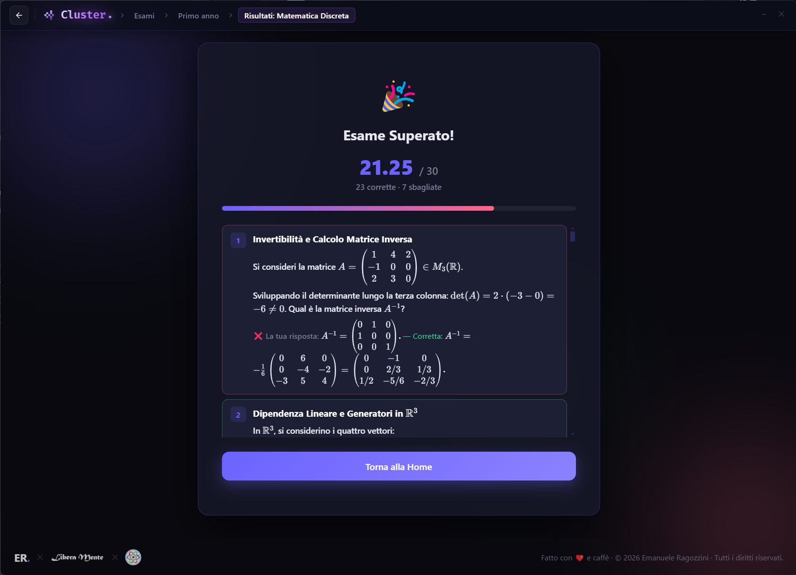

  

<h1 align="center">Cluster.</h1>

  <b>Hub di studio all-in-one, dispense interattive e simulatore d'esami multi-piattaforma (Desktop & Android) per il corso di laurea triennale in Informatica dell'Università degli Studi di Salerno (UNISA).</b>

---

## 👤 Autore & Licenza

**Emanuele Ragozzini** — *Progetto ideato e sviluppato per gli studenti del Dipartimento di Informatica (UNISA).*  
Portfolio: [emanuele-ragozzini.netlify.app](https://emanuele-ragozzini.netlify.app/)

Questo progetto è rilasciato sotto licenza [PolyForm Strict 1.0.0](LICENSE). È utilizzabile liberamente per scopi personali e non commerciali; la modifica, la ridistribuzione o l'uso commerciale non sono consentiti senza autorizzazione.

Fatto con ❤️ e caffè. © 2026 Tutti i diritti riservati.

---

## 📸 Anteprima

  
  

---

## 🌟 Cos'è Cluster?

**Cluster** è l'ecosistema definitivo per preparare gli esami del corso di laurea in Informatica all'Università di Salerno. Unisce in un'unica interfaccia scura in stile glassmorphism:
1. **Dispense complete e appunti universitari** per tutti gli insegnamenti del triennio.
2. **Simulatori d'esame fedeli alle prove ufficiali dei docenti UNISA**, con selettori bilanciati, test-case automatizzati e strumenti interattivi dedicati.
3. **Disponibilità Cross-Platform**: eseguibile nativo Desktop (Windows, Linux, macOS) e applicazione mobile Android offline.

---

## ✨ Caratteristiche & Motori Interattivi

### 🔬 Simulatori di Quesiti Specializzati
- 💻 **Editor di Codice Multi-file Monaco (C & Java)**: Compilazione ed esecuzione locale istantanea.
- 🔄 **Canvas Automi a Stati Finiti (DFA / NFA)**: Disegno interattivo di stati e transizioni con simulazione grafica passo-passo della stringa in ingresso.
- ⚙️ **Canvas Macchine di Turing (MdT)**: Modello visivo di computazione con nastro infinito, testina mobile e tabella delle transizioni.
- 🗄️ **Designer di Schemi Concettuali E-R**: Costruttore grafico di entità, attributi e relazioni con controllo automatico dei vincoli di cardinalità.
- 📈 **Studio di Funzione con Grafico Vettoriale SVG**: Tracciamento dinamico e validazione di asintoti, massimi, minimi e domini.
- 🧩 **Matrici e Ricorrenze di Programmazione Dinamica**: Tabelle interattive per verificare LCS, Zaino (Knapsack), Cammini Minimi e memoization.
- 📐 **Validatore Algebrico e KaTeX**: Riconoscimento di formule simboliche con tolleranza numerica intelligente.
- 🔌 **Circuiti Logici e Datapath MIPS**: Canvas interattivo per la simulazione hardware.

### 📖 Lettore Dispense & Suite Studio
- 📑 **Toolbar Evoluta**: Indice dei contenuti, navigazione per capitolo e selettore dimensioni testo.
- 🔍 **Ricerca Full-Text Istantanea**: Evidenziazione in tempo reale dei risultati all'interno delle dispense con contatore delle occorrenze.
- 🖨️ **Esportazione PDF Tipografica**: Generazione di dispense stampabili ad alta risoluzione tramite il motore nativo Chromium, completa di paginazione non invasiva e watermark Cluster.
- 📊 **Diagrammi e Formule**: Rendering di diagrammi d'architettura e formule matematiche inline.

### 🔒 Accesso & Profilazione
- **Login Istituzionale Associativo**: Verifica delle credenziali studente (Email e Matricola)
- **Dashboard Statistiche & Radar Competenze**: Tracciamento dello storico delle prove svolte e diagnosi puntuale delle competenze per argomento/tag

---

## 📥 Download Eseguibili

I file eseguibili pronti all'uso per tutte le piattaforme supportate sono disponibili nella sezione [**Releases**](../../releases)
